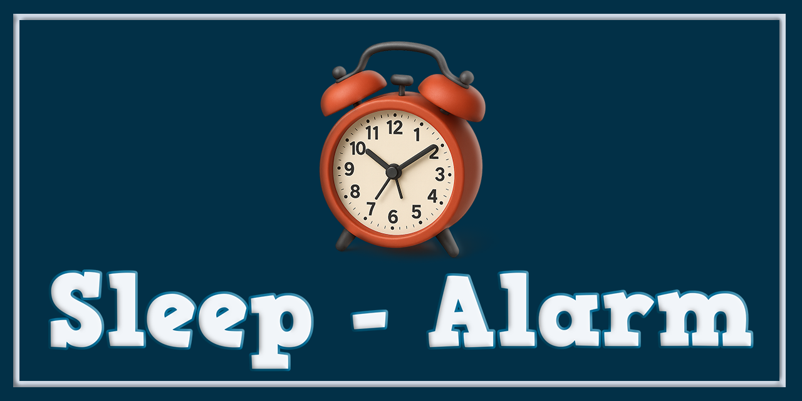
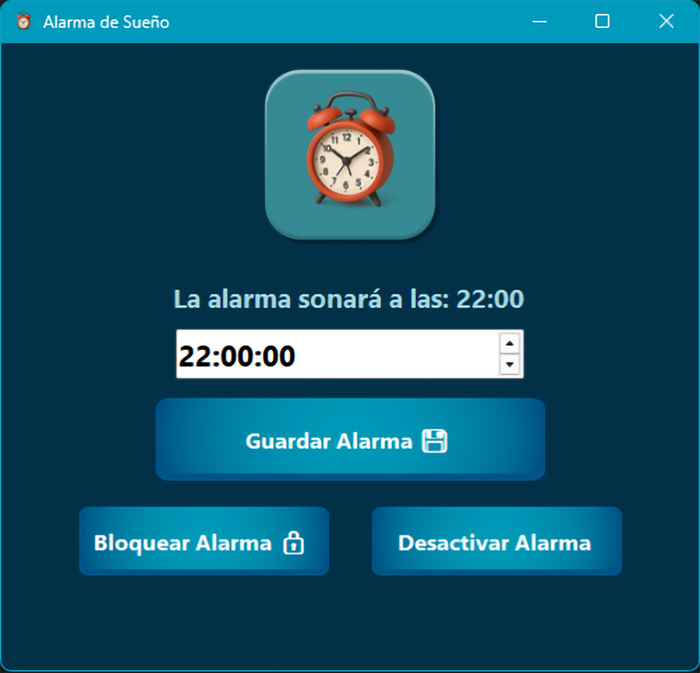

# ⏰ AlarmaSueño – Alarma Motivacional para Dormir Mejor (Windows | C#)

AlarmaSueño es una aplicación de escritorio para Windows, desarrollada en **C# con Windows Forms**, cuyo objetivo es mejorar la rutina de sueño mediante una alarma inteligente, frases motivacionales, ejecución en segundo plano y una arquitectura sólida y mantenible.

El proyecto aplica **Clean Architecture**, principios **SOLID** e **Inyección de Dependencias (DI)**, con énfasis en persistencia de estado, confiabilidad, experiencia de usuario e integración profunda con el sistema operativo.

> 📦 **Distribución:** el proyecto se entrega como **archivo ejecutable (.exe)** listo para usar, disponible en la sección **Releases** del repositorio.



---

## 🚀 Badges


---

## 📚 Tabla de Contenidos

* [✨ Características](#-características)
* [🏗️ Arquitectura](#️-arquitectura)
* [⚙️ Conceptos Clave](#-conceptos-clave)
* [🧪 Pruebas Unitarias](#-pruebas-unitarias)
* [📸 Capturas de Pantalla](#-capturas-de-pantalla)
* [📋 Requisitos](#-requisitos)
* [🚀 Uso](#-uso)
* [📦 Instalación (Release)](#-instalación-release)
* [🛡️ Seguridad y Buenas Prácticas](#️-seguridad-y-buenas-prácticas)
* [🤝 Contribuciones](#-contribuciones)
* [👤 Autor](#-autor)
* [📄 Licencia](#-licencia)

---

## ✨ Características

* ⏰ **Ejecución automática** de alarmas mediante el **Programador de Tareas de Windows**
* 💬 **Frases motivacionales dinámicas** al activarse la alarma
* 🔔 **Reproducción de audio** integrada
* 💤 **Función posponer (Snooze)** configurable
* 🔒 **Sistema de Bloqueo de configuración** para evitar cambios accidentales
* 🚀 **Inicio automático con Windows** (opcional)
* 🧠 **Persistencia completa del estado** (alarma, bloqueo y snooze sobreviven reinicios)
* 🌐 **Soporte multi‑idioma (I18n)**
* 🖥️ **Ejecución en segundo plano** con icono en la bandeja del sistema
* 🖥️ **Integración con la bandeja del sistema** (Tray Icon)
* 🔁 **Ejecución de una sola instancia de la aplicación**
* 🎨 **Interfaz moderna y mejorada** con efectos visuales, logotipo dinámico y diálogos personalizados
* 🚀 **Ejecución en segundo** plano con restauración controlada de la ventana

---

## 🏗️ Arquitectura

El proyecto está organizada siguiendo **Clean Architecture**, garantizando separación de responsabilidades y facilidad de mantenimiento:

```
AlarmaSueño
│
├── AlarmaSueño.Core
│ ├── AlarmManager
│ ├── SettingsManager
│ ├── PhraseProvider
│ ├── AudioPlayer
│ ├── TrayIconManager
│ ├── WindowsIntegration
│ └── Interfaces
│
├── AlarmaSueño.UI
│ ├── MainForm
│ ├── Dialogs (ConfirmationDialog, AboutForm, etc.)
│ ├── ResourceLoader
│ └── UI Enhancers
│
├── AlarmaSueño.Infrastructure
│ ├── Persistencia basada en archivos
│ ├── Logging
│ └── Integración con el sistema operativo
│
└── Assets / Resources
├── Imágenes
├── Iconos
└── Audio

```

✔️ Inyección de dependencias con Microsoft.Extensions.DependencyInjection 
✔️ UI desacoplada de la lógica de negocio 
✔️ Preparado para futuras migraciones **WPF / MAUI**

---

## ⚙️ Conceptos Clave

🔁 Persistencia del Estado

* El estado de snooze se conserva incluso si la aplicación se cierra o el sistema se reinicia

* El bloqueo de la alarma se mantiene activo hasta que el usuario lo deshabilita explícitamente

🖥️ Integración con Windows

* Uso del Programador de Tareas de Windows para garantizar la ejecución de la alarma

* Icono en la bandeja del sistema para restaurar o cerrar la aplicación

* Prevención de múltiples instancias mediante mensajería de Windows

🔒 Lógica de Bloqueo y Posposición

* El usuario puede bloquear la configuración de la alarma

* Durante el snooze, toda la interfaz queda deshabilitada hasta que expire

---

## 🧪 Pruebas Unitarias

El proyecto incluye pruebas unitarias utilizando **Moq** para validar la lógica crítica:

* `AlarmManager`
* `SettingsManager`
* `PhraseProvider`

✔️ Todas las pruebas se ejecutan correctamente
✔️ Sin dependencias directas de UI
✔️ Enfoque en confiabilidad y regresión

---

## 📸 Capturas de Pantalla



---

## 📋 Requisitos

* **Sistema Operativo:** Windows 10 u 11
* **.NET Runtime:**

  * Para ejecutar el `.exe` **no es necesario instalar Visual Studio**
  * Puede requerir **.NET Desktop Runtime 6.0 o superior** si no está presente
  
---

## 🚀 Uso

1. Ejecuta `AlarmaSueño.exe`
2. Configura la hora de la alarma
3. (Opcional) Bloquea la configuración
4. Se Cierra o Minimiza la aplicación automaticamene (queda en la bandeja del sistema y continúa en segundo plano)
5. Al activarse la alarma:

   * Se reproduce el audio
   * Se muestra una frase motivacional
   * Puedes **cerrar** o **posponer** la alarma 

---

## 📦 Instalación (Release)

1. Ve a la **sección Releases** del repositorio:
   👉 [https://github.com/Pablitus666/Sleep---Alarm/releases](https://github.com/Pablitus666/Sleep---Alarm/releases) 
2. Descarga el archivo:

   * `AlarmaSueño.exe`
3. Coloca el archivo en cualquier carpeta de tu PC
4. Ejecuta el `.exe`

📌 **No requiere instalación ni configuración adicional**

---

## 🛡️ Seguridad y Buenas Prácticas

* Manejo seguro de excepciones con logging
* Liberación correcta de recursos (`Dispose`)
* Separación estricta de capas
* Sin rutas del sistema codificadas de forma rígida
* Código preparado para pruebas y refactorización

---

## 🤝 Contribuciones

Las contribuciones son bienvenidas:

* Fork del repositorio
* Crear rama feature / fix
* Enviar un Pull Request bien documentado

---

## 👤 Autor

**Pablo Téllez A.**
Tarija – Bolivia 🇧🇴

---

## 📄 Licencia

Este proyecto está licenciado bajo la
**GNU General Public License v3.0 (GPLv3)**

Consulta el archivo [LICENSE](LICENSE) para más información.
Más detalles en: [https://www.gnu.org/licenses/gpl-3.0.html](https://www.gnu.org/licenses/gpl-3.0.html)
